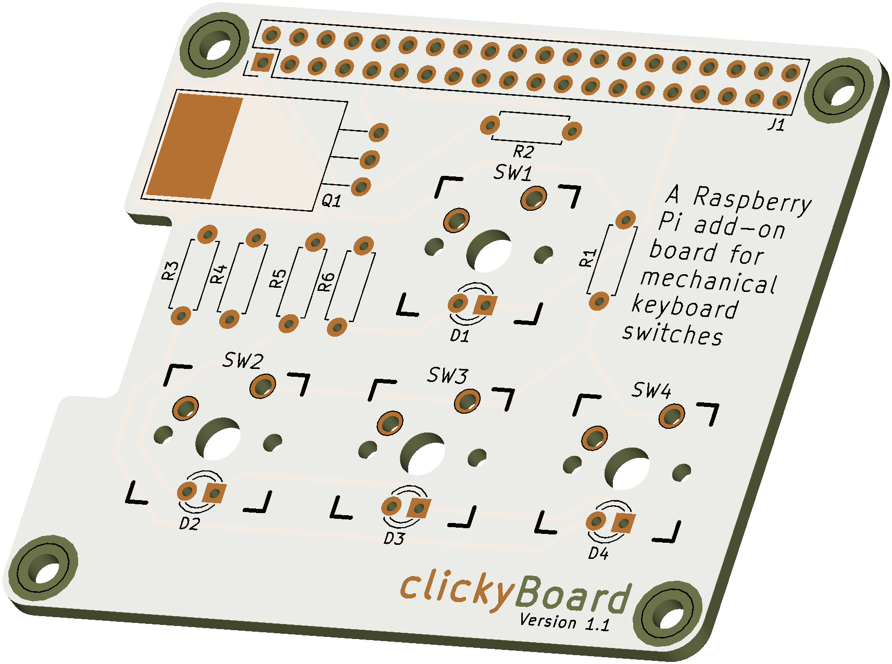

# clickyBoard
A Raspberry Pi add-on board that adds a simple switch and LED circuit for GPIO programming, using mechanical keyboard switches

Read the [documentation file](Documentation/clickyBoard.pdf).

## Keyboard.pretty

Kicad files uses [Keyboard.pretty](https://github.com/stormbard/Keyboard.pretty), the KiCad Module Repository for keyboard PCB creation.

## FAQ

### What does clickyBoard add to my Pi?

clickyBoard adds a simple circuit to your Raspberry Pi for GPIO programming, featuring four input switches, as well as LED backlighting which can be controlled with a single output.

The board uses Cherry MX compatible switches, which are popular keyboard switches, that are widely and cheaply available along with compatible keycaps.

### Has the design been tested?

clickyBoard version 1.0 was manufactured and tested, and the discovered errors were rectified in board version 1.1. This latest version has not been manufactured as of yet, so please perform your own checks before sending the design off to be manufactured.

### Is this a HAT?

Not quite. The Raspberry Pi HAT [specification](https://github.com/raspberrypi/hats) requires a HAT to have an ID EEPROM. To keep this add-on board simple to assemble, this has been ommited. The clickyboard does adhere to the HAT mechanical specifications.
